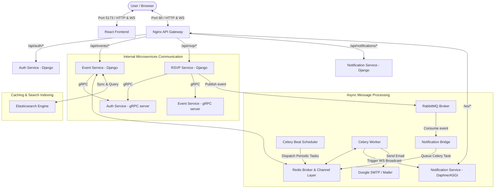

# 🚀 MetUps — Real-Time Microservices Meetup Planning Platform

[](https://www.docker.com/)
[](https://react.dev/)
[](https://www.djangoproject.com/)
[](https://grpc.io/)
[](https://www.rabbitmq.com/)
[](https://redis.io/)
[](https://www.nginx.com/)

MetUps is a high-performance, real-time, containerized microservices platform designed for planning, organizing, and joining meetups. Built with scalability and responsiveness in mind, the platform divides responsibilities across specialized, lightweight microservices that communicate efficiently via **gRPC** (for low-latency synchronous calls) and **RabbitMQ** (for reliable asynchronous event-driven messages).

---

## 🏗️ System Architecture

The project features a state-of-the-art cloud-native architecture. All client requests hit a central Nginx Gateway, which handles SSL termination (when configured), path-based reverse proxying, and WebSocket upgrades.



---

## 🚦 Network Topology & Port Mapping

| Service Name | Technology / Stack | Hostname (Docker Network) | Direct Port (Debug) | Gateway Path | Description |
| :--- | :--- | :--- | :--- | :--- | :--- |
| **nginx** | Nginx (Alpine) | `nginx` | **80** | `/` | API Gateway & Reverse Proxy |
| **frontend** | React + Vite + Tailwind | `frontend` | **5173** | N/A | React Single Page Application (SPA) |
| **auth-django** | Python + Django REST + JWT | `auth-django` | 8001 | `/api/auth/` | User registrations, login, JWT issuance |
| **auth-grpc** | gRPC (Server) | `auth-grpc` | 50051 (Internal) | N/A | Synchronous user token verification |
| **event-django**| Python + Django REST | `event-django` | 8002 | `/api/events/` | Meetup creation, details, list, caching |
| **event-grpc** | gRPC (Server) | `event-grpc` | 50052 (Internal) | N/A | Synchronous event details/capacity checks |
| **rsvp-django** | Python + Django REST | `rsvp-django` | 8003 | `/api/rsvp/` | Event RSVPs (join, leave, counts) |
| **notif-django**| Python + Django REST | `notif-django` | 8004 | `/api/notifications/` | Notification templates & user settings |
| **notif-asgi** | Daphne (ASGI Server) | `notif-asgi` | 8005 | `/ws/` | WebSockets server for live updates |
| **notif-celery**| Celery Worker | `notif-celery` | N/A | N/A | Asynchronous task processor (emails/pushes) |
| **notif-beat**  | Celery Beat Scheduler | `notif-beat` | N/A | N/A | Periodic task scheduler (reminders) |
| **notif-bridge**| Python command daemon | `notif-bridge` | N/A | N/A | Connects RabbitMQ events to Celery |
| **redis** | Redis (Alpine) | `redis` | 6379 | N/A | Celery broker, cache, Channels backplane |
| **rabbitmq** | RabbitMQ + Management UI | `rabbitmq` | 5672 / 15672 | N/A | Inter-service message broker |
| **elasticsearch**| Elasticsearch 8.19.19 | `elasticsearch` | 9200 | N/A | Search engine backing event search |

---

## 💾 Data Persistence & Storage

MetUps employs a hybrid persistence model to support microservice isolation and search performance:
- **Isolated SQLite Databases:** Each service container manages its own state using local SQLite database files (e.g., `auth-service/db.sqlite3`, `event-service/db.sqlite3`). These are bind-mounted directly, preserving development records across container updates.
- **Persistent Elasticsearch Indexes:** To persist Elasticsearch indices between runs, a named Docker volume (`es_data`) is mapped to `/usr/share/elasticsearch/data` in the `elasticsearch` container.
- **Volatile Caching:** Redis caches are volatile and live entirely in-memory.

---

## ⚙️ Service Specifications & Key Workflows

### 🔐 1. Authentication Service (Auth)
- Exposes REST endpoints (`/login/`, `/register/`) to issue secure JWT credentials.
- Launches a **gRPC verification server** (`port 50051`). Instead of other services duplicating token validation logic or hitting the auth database, they query `auth-grpc` synchronously to authorize requests.

### 📅 2. Event Service
- Manages meetup details, locations, schedules, and maximum attendee capacities.
- Implements a caching layer using **Redis** to store and serve high-traffic endpoints (`/api/events/` lists and details) with a TTL of 60 seconds. Caches are dynamically invalidated when events are modified or created.
- Integrates with **Elasticsearch** (via `django-elasticsearch-dsl` & `Elasticsearch 8.19.19` container on port `9200`) to support high-performance full-text search:
  - Indexes event attributes (`title`, `description`, `location`) in real-time on database writes/updates.
  - Exposes `/api/events/search/?q={query}` supporting debounced autocomplete and search-as-you-type prefix matching via Elasticsearch `phrase_prefix` multi-match queries.

### ✍️ 3. RSVP Service
- Handles the core business logic of joining and leaving meetups.
- Connects via **gRPC** to `auth-grpc` (to verify user identity) and `event-grpc` (to verify the event exists, is in the future, and has remaining capacity).
- On success, it publishes JSON events to **RabbitMQ** (e.g., `user_joined_event`, `user_left_event`, `event_full`).

### 🔔 4. Real-Time Notification Service
  - Built with a modular, highly decoupled design:
    - **Daphne (ASGI)**: Manages incoming WebSocket requests from the frontend client to push live capacity/attendee counters.
    - **Bridge (`notif-bridge`)**: Runs a persistent Python consumer loop listening to RabbitMQ. When it receives an RSVP event, it stores a reminder in the local SQLite database.
    - **Celery Beat (`notif-beat`)**: Runs a periodic scheduler that wakes up every 5 minutes to scan the database for upcoming reminders and dispatches reminder email tasks.
    - **Celery Worker**: Asynchronously triggers email confirmations and reminders (via Google SMTP) and broadcasts live JSON payload packets back to the ASGI WebSocket clients using Redis as the backplane.

---

## 🛠️ Local Development & Setup

### Prerequisites
Make sure you have [Docker](https://www.docker.com/) and [Docker Compose](https://docs.docker.com/compose/) installed on your machine.

### Step 1: Environment Variables
Create a `.env` file in the root directory for django secrets:
```env
AUTH_SECRET_KEY=generate-a-secure-secret-key-here
EVENT_SECRET_KEY=generate-another-secure-secret-key-here
```

Create a `.env` file inside the `frontend/` directory pointing to the gateway URLs:
```env
VITE_API_BASE_URL=http://localhost/api
VITE_WS_BASE_URL=ws://localhost/ws
```

### Step 2: Spin Up the Infrastructure & Microservices
Bring up the entire suite of services in detached mode:
```bash
docker compose up -d
```

Confirm that all **15 containers** are up and healthy:
```bash
docker compose ps
```

### Step 3: Run Migrations (Optional)
The databases come pre-configured with SQLite db files containing seed data. If you need to make changes, execute migrations within the respective container:
```bash
docker compose exec auth-django python manage.py migrate
docker compose exec event-django python manage.py migrate
docker compose exec rsvp-django python manage.py migrate
docker compose exec notif-django python manage.py migrate
```

### Step 4: Populate/Rebuild Search Index (Optional)
If you need to initialize or rebuild the Elasticsearch search index from the SQLite database:
```bash
docker compose exec event-django python manage.py search_index --rebuild -f
```

---

## 🔬 Gateway Verification & Endpoints

You can verify that the Nginx API gateway (port 80) is routing requests correctly to the backend services by running:

```bash
# Test Auth Routing (Returns Method Not Allowed 405 on GET - expected)
curl -i http://localhost/api/auth/login/

# Test Events Routing (Returns 200 OK with event payload)
curl -i http://localhost/api/events/

# Test RSVP Routing (Returns 200 OK with RSVP count)
curl -i http://localhost/api/rsvp/1/count
```

### Accessing the Applications:
* **Frontend Web App**: Navigate to [http://localhost:5173](http://localhost:5173) in your browser.
* **RabbitMQ Dashboard**: Go to [http://localhost:15672](http://localhost:15672) (default credentials: `guest` / `guest`).

---

## 📜 License
Distributed under the MIT License. See `LICENSE` for more information.
